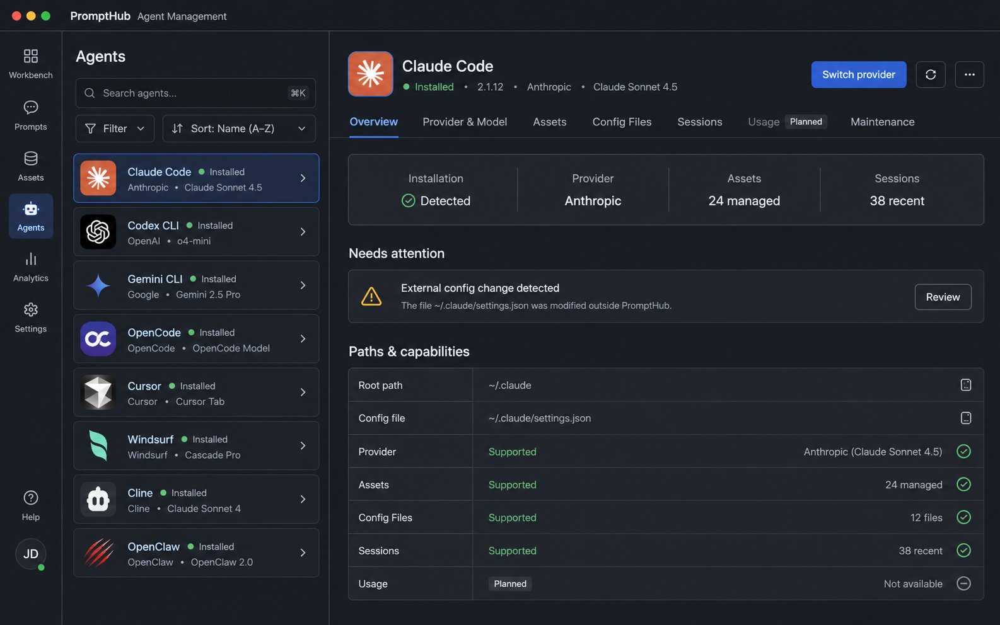

# UI Design

## Scope

This document completes the screen-level design for `DES-AGENT-010`. It defines layout, interaction, capability states, responsive behavior, component boundaries, and regression expectations. It does not introduce a separate visual language or a marketing-style dashboard.

## Approved Visual Direction



The image above is the approved first visual direction for the production workspace. It is a design baseline rather than a literal screenshot or final fixture.

The later product acceptance supersedes the image's generic `Assets` label: Skills, MCP, Rules, and Plugins are direct top-level tabs. The image remains authoritative for pane hierarchy, density, header composition, active-state contrast, and operational visual character.

The following parts are normative:

- Existing application rail on the far left, complete Agent list in the middle, and selected Agent detail on the right.
- Common and detected Agents appear first, while the list remains scrollable/searchable across the complete registry.
- Agent rows show icon, name, installation/configuration state, and concise provider/model context.
- Selection is obvious without disabling or visually suppressing unselected Agents.
- Every Agent opens the same header, stable tab bar, summary, attention, path, and capability structure.
- The primary command is contextual, such as `Switch provider`, `Configure`, or `Diagnose`.
- Unsupported or planned capabilities remain in their stable positions and use disabled styling, as demonstrated by `Usage`.
- Supported capabilities are visibly actionable. Skills, MCP, Rules, and Plugins use direct top-level tabs; Provider, Config Files, Sessions, and Usage remain visibly disabled until their adapters are ready.
- Overview favors a compact summary band, an actionable attention queue, and a structured paths/capabilities table instead of decorative dashboard cards.

The following details are illustrative and may change during implementation:

- Example versions, providers, model names, counts, paths, warnings, and session totals.
- Exact third-party icons when the repository has a different canonical asset.
- Exact pane widths and spacing when screenshot verification finds a better fit at supported window sizes.
- Example rail labels that differ from the current PromptHub navigation taxonomy.

Production implementation must preserve the normative interaction and hierarchy even when mock data and visual details are replaced with real application state.

## Design Principles

- All built-in and enabled custom Agents use one workspace and one detail shell.
- Agent identity is always clickable; capability availability controls actions, not navigation.
- Only locally detected Agents enter the management list. Common and pinned
  Agents affect ordering within that installed set; registry-only platforms
  remain outside the workspace until detection succeeds.
- Dense operational information is preferred over decorative cards and oversized headings.
- Existing PromptHub tokens, wallpaper panels, Lucide icons, typography, and interaction patterns remain authoritative.
- Skill, MCP, Rules, and Plugin editing remains in each owning workspace; Agents provides context and orchestration.
- Unsupported capabilities remain visible and disabled so users can understand the platform boundary.

## Global Entry

Add an `Agents` item to the primary rail alongside the existing asset modules.

- Icon: use an existing Lucide Agent/Bot-compatible icon selected consistently with current navigation.
- Label: localized `Agents`.
- Active state: reuse the current rail active treatment.
- Settings continues to own advanced path overrides and custom Agent registration.
- Opening an Agent from Skill/MCP/Plugin distribution navigates to the same Agent detail route and the relevant top-level asset-domain tab.

## Workspace Frame

The desktop workspace uses two persistent panes inside the existing application shell:

```text
┌─────────────────────────────── PromptHub shell ───────────────────────────────┐
│ rail │ Agent list pane │ selected Agent detail shell                         │
│      │                 │ header                                               │
│      │ search/filter   │ tabs                                                 │
│      │ Agent rows      │ selected tab content                                 │
│      │                 │                                                      │
└───────────────────────────────────────────────────────────────────────────────┘
```

### Dimensions

- Primary rail: reuse current application width.
- Agent list pane: default `18rem`, resizable within `15rem` to `24rem` if the shared sidebar resize behavior is reused.
- Detail pane: `min-width: 0`, occupies remaining space.
- Detail content maximum readable width is applied only to long-form config/transcript text, not to tables and inventories.
- Header and tab bars use stable heights so loading and status changes do not shift the page.
- Header, tab bar, page canvas, summary cells, and content panels use distinct opaque surfaces. Avoid stacking translucent gray layers that collapse hierarchy in the light theme.
- Summary and asset-domain accents use restrained semantic colors; neutral gray remains supporting chrome rather than the dominant content color.

## Agent List Pane

### Toolbar

The list toolbar contains:

- Search input: name, aliases, provider, executable and resolved path metadata.
- Filter menu: All, Installed, Configured, Needs Attention, Not Detected, Custom.
- Sort menu: Recommended, Name, Recently Used, Health.
- Add custom Agent command, routed to the existing configuration workflow.
- Refresh icon button for detection and summary reload.

Do not expose separate buttons for every filter. Use a menu and compact active-filter summary to preserve list width.

### Default Ordering

Ordering is deterministic:

1. User-pinned Agents.
2. Detected or explicitly configured Agents.
3. Curated common priority.
4. Remaining built-in Agents by localized stable name.
5. Enabled custom Agents, promoted into steps 1 or 2 when pinned/detected/configured.

Search filters the complete registry, not only the current visible viewport or supported adapters.

### Agent Row

Each row has a stable minimum height and contains:

- Platform icon.
- Agent display name.
- Compact installation/configuration status.
- Current provider/model when supported and known.
- One health indicator with accessible text.
- Pin action revealed on hover/focus or available in the row menu.

The row itself always opens Agent detail. A missing executable, directory, provider adapter, or session adapter never disables the row.

Status examples:

- Installed
- Configured
- Not detected
- Needs attention
- Setup incomplete

Avoid showing multiple competing colored badges in one row. Provider and model use muted secondary text; health owns the primary status color.

## Agent Detail Shell

### Header

The fixed detail header contains:

- Platform icon and Agent name.
- Installation/version status.
- Current provider/model summary when available.
- Primary command: context-dependent `Configure`, `Switch provider`, or `Diagnose`.
- Refresh icon button.
- Overflow menu: Pin, Open folder, Advanced path settings, Export diagnostics.

The header does not become disabled when one capability is unsupported. Primary command selection follows this order:

1. Blocking setup action.
2. Provider switch when provider management is supported.
3. Diagnose when health is degraded.
4. Open the first supported asset-domain tab when only asset/path capabilities are available.

### Tabs

Every Agent uses this stable order:

1. Overview
2. Provider & Model
3. Appearance
4. Skills
5. MCP
6. Rules
7. Plugins
8. Config Files
9. Sessions
10. Usage
11. Maintenance

Tabs stay in the same position for every Agent. Capability state affects tab interaction:

| Capability state | Tab/action behavior                                                       |
| ---------------- | ------------------------------------------------------------------------- |
| `supported`      | Enabled and interactive                                                   |
| `partial`        | Enabled; supported sub-actions work, unavailable sub-actions are disabled |
| `planned`        | Visible and disabled with localized “planned” reason                      |
| `unsupported`    | Visible and disabled with concise platform-specific reason                |

Disabled tabs do not invoke IPC and do not navigate to empty pages. Hover/focus exposes the reason through a tooltip; screen readers receive the same reason through accessible description.

### Appearance Tab

Appearance remains one top-level Agent tab. Inside that tab, a narrow left icon
rail separates the two independent asset types without creating more top-level
tabs:

- Desktop skins: selected by default, with installed count and the skin icon.
- Pets: local Pet inventory, with installed count and the Pet icon.

The selected rail item controls one focused right-hand workspace. Desktop skin
controls and Pet controls are never mixed in the same scrolling page:

- Native appearance: compact structured controls for adapter-owned appearance
  settings and a restore action, shown only in the desktop-skin workspace.
- Desktop skins: installed theme grid with preview, compatibility state, source,
  apply, restore, import, export, open-folder and delete actions.
- Pets: local Pet grid with preview, validation state, import, export,
  open-folder and delete actions.

The workspace header exposes one refresh icon and one contextual import action.
Counts and invalid-item feedback are scoped to the selected destination. The
last successfully applied skin uses a clear status treatment and keeps Restore
visible without claiming that a later standalone Codex restart retained it.
Compatibility warnings are operational messages, not decorative cards. Agents
without an appearance adapter keep the stable tab disabled with its reason.

## Overview Tab

Overview is a compact operational summary, not a card dashboard.

### Summary Band

Show four aligned summaries in one full-width band:

- Installation: detected state and executable version.
- Provider: current verified provider/model or capability reason.
- Skills: configured path and installed/managed count when available.
- Sessions: recent count and last activity or capability reason.

### Attention Queue

Display only actionable items:

- Missing executable or invalid path.
- Native config conflict or external modification.
- Missing credential reference.
- Failed provider test.
- Asset drift or failed distribution.
- Session parser error.

Each item has one clear action. Do not nest cards inside the summary band.

### Paths And Capabilities

Show resolved root, executable, config roots, asset roots, and a compact capability matrix. Paths have copy and open-folder icon buttons. Unsupported capabilities are muted, not presented as errors.

## Provider & Model Tab

Use a split operational layout:

- Left column: Provider Profile list, search, add/import actions.
- Right column: selected profile form, model mappings, connection status, activation controls.

### Provider Profile Row

- Name and provider kind.
- Endpoint origin without sensitive query content.
- Model summary.
- Active/verified marker derived from native config.
- Last test result and age.
- Overflow: duplicate, export, archive.

### Profile Editor

Use structured inputs based on adapter schema:

- Provider preset/custom selector.
- Endpoint.
- Secure credential field with replace/remove actions; never re-render existing secret.
- Model route fields.
- Adapter-specific advanced options in a disclosure section.
- Test button and Activate primary command.

### Activation Preview

Activation opens a large modal with:

- Agent and target file identity.
- Current, desired, preserved, backfilled, conflicting and unsupported field groups.
- Masked secret changes.
- Backup/rollback statement.
- Cancel and Activate commands.

Conflicts require explicit per-field resolution or cancellation. Success closes the modal only after post-write verification. Failure keeps diagnostics visible and states whether rollback succeeded.

## Asset-Domain Tabs

Skills, MCP, Rules, and Plugins are four direct top-level tabs. The generic Assets tab is removed. Do not add a segmented control, secondary sidebar, aggregate Assets page, or navigation-only rows.

Each asset-domain page contains:

- Asset kind, detected count, and resolved path.
- Managed/external or platform-specific status where real state is available.
- A compact inline inventory or a scoped empty state.
- A scoped refresh action that reloads the owning store and selected Agent aggregate.
- A domain-specific semantic accent: cyan for Skills, blue for MCP, amber for Rules, and violet for Plugins. The accent identifies the active domain without replacing standard PromptHub tokens.

Skills, MCP and Plugins use one shared card anatomy derived from the accepted
Plugins presentation: a fixed 40px identity slot, title/status row, bounded
two-line description, one-line source, wrapping metadata chips and a bottom
divider with aligned 32px icon actions. Skill names provide the fallback icon,
MCP uses the server icon, and Plugins preserve package artwork with a plug
fallback. Domain actions may differ, but the card regions and spacing do not.
The Agent tab label is the stable product term `Plugins` in every locale.

`DES-AGENT-092` fixes the shared card shell at 232px and assigns stable content
slots: 24px for title/status, 40px for the two-line description, 16px for the
source and 40px for metadata. Overflow is clipped within the owning slot and
the action footer remains anchored by the shared card shell. Supplementary
inventory chips share the bounded metadata region rather than adding another
variable-height row.

The Agent workspace does not introduce an “Agent copy” editor or duplicate durable state. Canonical editing and mutation continue to use the owning Skill/MCP/Rules/Plugin services when inline actions are added.

Cross-kind batch operations are not part of the first delivery. If a future domain needs deeper navigation, it may add navigation inside that domain without restoring a generic Assets parent page.

## Config Files Tab

The first enabled state uses the existing two-pane local file editor inside the Agent detail surface:

- Left pane: only verified config files plus their parent folders.
- Right pane: syntax-aware text viewing and explicit Edit/Save controls.
- Header: resolved Agent root, config count, and Open Agent folder action.
- Missing allowlisted config files remain selectable and are created only after an explicit save.
- Rename, delete, arbitrary create, snapshots, versions and restore are absent in this phase.

Authentication files, sessions, logs, caches and databases are excluded from the in-app config inventory. The system file manager remains the escape hatch for inspecting the complete Agent directory.

Structured editing, redacted diff and snapshot history appear only after an adapter owns the schema and safe backup/restore behavior.

## Conversation History And Agent History

The primary Conversation History entry is project-centered and spans all
verified Agent sources. It uses a desktop three-pane layout:

- Project/filter pane: registered projects, `needs-project`, deleted/archive
  views, source Agent, date and tags.
- Conversation list: source Agent identity, title, updated time, message count
  and source status.
- Transcript reader: project, source Agent/model, bounded visible messages,
  lineage and action feedback.

The History tab inside Agent detail reuses the same catalog and reader with the
source Agent fixed. It does not own a second session list or annotation store.

Primary commands:

- **Resume in original Agent** executes verified native resume.
- **Continue in another Agent** opens a target-Agent dropdown, then an exact
  context preview before launch.
- **Export** opens JSON/Markdown and single/batch options.

Secondary commands export the transcript or request adapter-owned permanent
native deletion when supported. Right-clicking a row exposes the same verified
continuation/export/delete actions. No generic metadata editor, removed state or
Restore action is presented.
The target dropdown shows only the Agent icon and full display name so options
remain readable in the compact toolbar. Selecting an Agent never launches
immediately; capability resolution happens in the reviewed apply plan. The
local-index switch and source diagnostics live in History
Source Settings rather than the ordinary list header.

The transcript action row is a lightweight header row rather than a card nested
inside the detail pane. Selected conversation rows use a neutral accent surface
and explicit foreground tokens in both themes. Message pagination keeps a fixed
20-message viewport; duplicate or empty native cursor pages are skipped within a
bounded hop limit and stale page state is clamped to the last page containing
messages, so navigation cannot leave an empty transcript surface.

On narrow layouts, project/filter, list, detail, handoff preview and target
selection become explicit navigable steps with Back actions and restored focus.

- Resume through a validated executable/argument request when supported.
- Open project folder.
- Add local tag or note.

The transcript is read-only. Missing sources retain metadata and local notes with a clear source-missing state.

## Menu Bar Quota Popover

Primary-clicking the macOS menu-bar icon directly opens a 392 x 540
tray-anchored quota popover. Secondary click keeps the native action menu, which
does not repeat an `Agent Quotas` command. The surface uses one compact row per
supported Agent. Following CodexBar's real usage-card hierarchy, product icon,
name and plan form the header; the most constrained metric appears below with a
small inline tabular remaining value, slim progress bar and reset time. Normal,
warning and critical progress states remain visible without turning the
percentage into the dominant visual element.

Rows with multiple metrics expose a chevron-only details control. Expanded
details show every metric and its bounded reset countdown without resizing the
header or percentage columns. The inventory scrolls inside the popover while
the title and refresh action remain fixed. Loading, missing credentials,
expired credentials and unavailable providers use explicit text and an em dash
or ellipsis rather than a misleading zero. A cached successful result remains
visible when a refresh fails and is marked as cached.

The popover follows the current light, dark or system theme and uses existing
PromptHub tokens and platform artwork. It must remain readable at its fixed
size without text overlap, horizontal scrolling or detached native submenus.

## Usage Tab

Usage remains the same tab for every Agent but can be disabled by capability.

When available, show:

- Time range control.
- Requests, tokens, cache, success rate and cost where evidence exists.
- Trend chart and model/provider breakdown.
- Evidence source and last updated time.

Do not combine session-derived estimates, provider quota, and future proxy-observed usage into one unlabeled number.

## Maintenance Tab

Show operational settings and diagnostics:

- Detection source, executable path and version.
- Latest known version/update support.
- Root and config paths.
- Adapter names/versions and capability matrix.
- Re-detect, open paths, test permissions and export diagnostics.
- Future install/update plan and confirmation actions.
- Link to advanced Agent path settings.

Unsupported CLI lifecycle actions remain disabled; manual installation guidance may be available through a secondary help action.

## Empty, Loading, And Error States

### Workspace

- Registry loading: list skeleton with stable row heights; detail shell remains stable.
- No search results: clear the search action; do not suggest adding an Agent when the enabled registry is merely searched.
- No enabled Agents: link to Agent settings so the user can enable built-in or custom platforms.

### Detail

- Detection pending: show last known data as stale where available.
- Agent not detected: Overview and path/settings actions remain available.
- Capability planned/unsupported: disabled control plus reason; no generic error illustration.
- Partial failure: retain successful sections and show scoped retry.
- Offline provider test: preserve profile editing and return structured network status.

## Responsive Desktop Behavior

### Wide: `>= 1280px`

- Persistent Agent list and detail.
- Provider and Sessions use split panes.
- Overview summaries use four columns when content fits.

### Standard: `960px - 1279px`

- Persistent Agent list at minimum width.
- Summary band uses two columns.
- Provider and Sessions keep split panes with constrained secondary width.

### Narrow: `< 960px`

- Agent list becomes a navigable page; selecting an Agent opens detail with a Back command.
- Tabs remain stable and horizontally scroll without shrinking labels into unreadable text.
- Provider/session split panes become list -> detail navigation.
- No control or status text overlaps the title bar, header actions, or adjacent content.

## Keyboard And Accessibility

- Agent rows, tabs, menus, list items and disabled reasons are keyboard reachable.
- Arrow keys may navigate list/tabs only when following established component behavior.
- Focus returns to the originating control after modal close or detail back navigation.
- Disabled capability reasons use accessible descriptions, not color alone.
- Status icons have hidden accessible labels; decorative icons are `aria-hidden`.
- Live regions announce refresh, activation, rollback and test results without exposing secrets.
- Reduced motion disables slide transitions while retaining state changes.

## Component Boundaries

```text
AgentsWorkspace
├── AgentsListPane
│   ├── AgentsListToolbar
│   └── AgentListRow
└── AgentDetailShell
    ├── AgentDetailHeader
    ├── AgentDetailTabs
    ├── AgentCapabilityGate
    └── sections/
        ├── AgentOverviewSection
        ├── AgentProvidersSection
        ├── AgentSkillsSection
        ├── AgentMcpSection
        ├── AgentRulesSection
        ├── AgentPluginsSection
        ├── AgentConfigFilesSection
        ├── AgentSessionsSection
        ├── AgentUsageSection
        └── AgentMaintenanceSection
```

Behavior hooks remain separate from sections:

- `use-managed-agents.ts`: query, selection, filtering, ordering, pinning.
- `use-agent-detail.ts`: summary orchestration and refresh.
- `use-agent-provider-actions.ts`: import, test, preview, activate, rollback.
- `use-agent-asset-domain.ts`: scoped selectors and owning-domain actions for each direct asset tab.
- `use-agent-sessions.ts`: scan, pagination, read and resume.

Pure logic belongs in `agent-ui-utils.ts`: ordering, capability presentation, status derivation, filter matching, and view-model formatting.

## `DES-AGENT-066`: Agent-Scoped Rules Workspace Reuse

`AgentRulesWorkspace` is a thin selection adapter around the existing
`RulesManager`; it does not duplicate the rule editor, history, AI rewrite,
conflict resolution, save flow or durable state.

- The adapter reads the selected Agent's resolved `paths.rules` and the
  descriptors already owned by `useRulesStore`.
- Matching is linear in the bounded descriptor list. It first compares
  normalized paths, then falls back to the built-in platform id or
  `custom:<agent-id>` only when path matching is unavailable.
- The editor is mounted only after `currentFile.id` matches the selected
  descriptor. This prevents stale content from the previously selected Agent
  from flashing during an asynchronous read.
- An empty cache uses the ordinary Rules list load. A loaded cache with no
  match performs at most one forced scan for the current Agent/path key.
  Further failure remains visible with a manual retry.
- The generic Agent asset inventory remains responsible for MCP and Plugin
  lists. The Agent Rules tab targets one global rule file and therefore does
  not paginate or present unrelated project/global rule descriptors.
- File reads, writes, snapshots, conflicts and recovery continue through the
  existing Rules IPC and store. No database, filesystem layout, preload or IPC
  contract changes are introduced.

## `DES-AGENT-067`: Compact Rules Editor Actions

`RulesManager` keeps one full-width editing canvas and a compact action header.
It no longer reserves a persistent muted side column for secondary workflows.

- `RuleAiRewriteDialog` owns instruction entry and progress/error interaction.
  Success updates the existing store draft and closes the dialog; failure keeps
  it open. The dialog never writes the source file directly.
- `RuleHistoryDialog` receives the current bounded snapshot array and owns only
  presentation state such as show-more/show-less. Snapshot selection, deletion,
  diff preview and restore remain owned by `RulesManager` and `useRulesStore`.
- AI, history, open-location and save actions share the file header. Snapshot
  preview replaces edit/save actions with back/restore while retaining access
  to version history.
- Header, toolbar, editor and dialogs use `bg-card`, `bg-background`,
  `border-border` and semantic primary/status accents. Large `bg-muted` bands
  are not used as the dominant editor surface.
- The dialogs reuse the shared `Modal`, `Button`, toast and confirmation
  components. No new IPC, persistence, filesystem path or durable UI state is
  introduced.

## `DES-AGENT-068`: Content-Sized Agent Detail Header

The Agent identity/action row uses natural content height and vertically
centers its children. The tab strip is the next flow item with no synthetic top
margin or minimum-height spacer between the two rows.

- The existing 64px identity artwork remains stable; removing the outer
  `min-height` does not resize product artwork.
- Actions continue to wrap through the existing flex layout when horizontal
  space is constrained.
- Lifecycle guidance remains part of the identity block and expands the header
  only when that guidance is actually rendered.
- The change affects renderer layout only. It adds no state, persistence,
  contract, IPC, filesystem or network behavior.

## `DES-AGENT-069`: Edge-To-Edge Rules Canvas

The Rules content region treats the draft editor and snapshot diff as the
workspace surface rather than as cards inside another workspace surface.

- Remove the editor-region outer padding and the draft/diff wrappers' rounded
  border and shadow.
- Keep the compact status toolbar and its bottom divider so metadata remains
  distinct from editable or diff content.
- Retain bounded internal scrolling and the existing background/card tokens.
- Error notices may remain inset because they are temporary alerts rather than
  the primary work surface.
- The standalone Rules module and Agent Rules tab continue to share the exact
  same component and behavior.

## `DES-AGENT-070`: Shared Markdown Editor Surface

The Rules draft reuses the existing CodeMirror editor implementation already
used by Skill files, configured for Markdown and an explicit Rules aria label.
The shared editor adds the CodeMirror Markdown keymap so list and quote markers
continue naturally while retaining syntax highlighting, line numbers,
undo/redo, search, selection matching, indentation and bounded internal
scrolling.

- The Rules store remains the only draft owner; CodeMirror parent-value
  synchronization is annotated so it does not emit a second user change.
- Read-only AI progress uses the existing editable compartment rather than
  replacing the editor.
- No new editor dependency, persistent state, IPC or filesystem workflow is
  introduced.
- The shared editor component remains the sole CodeMirror lifecycle owner.
  Rules supplies only path, draft value, editable state and accessible labels;
  this keeps the longer declarative React surfaces free of parsing,
  persistence and editor-command business logic.
- `RuleMarkdownWorkspace` adds ephemeral Edit, Preview and Split presentation
  state around that editor. The compact selector is grouped on the toolbar's
  far right after the line and character counts, uses pencil, book and columns
  icons, and keeps the draft-status copy alone on the left.
  Document preview does not use an eye icon.
- Preview uses the existing sanitized `SkillMarkdown` renderer. Local heading
  links receive deterministic in-document ids and scroll within the preview;
  external links retain the existing external-browser behavior.
- Split synchronization annotates rendered Markdown blocks with source lines,
  builds an `O(b)` bounded anchor index for `b` rendered blocks, and maps each
  scroll event with `O(log b)` binary search. This avoids proportional scroll
  drift when rendered headings, lists and code blocks have different heights.
  A frame-scoped loop guard prevents the paired programmatic scroll from
  bouncing back.
- The floating return-to-top control appears only after meaningful preview
  scrolling and honors reduced-motion preference. These presentation states
  add no persistence, IPC, filesystem I/O or network work.

## `DES-AGENT-071`: AI Rewrite Endpoint Selection

`RuleAiRewriteDialog` reads configured providers and chat models from the
existing settings store and presents two shared `Select` controls above a
larger instruction field.

- Provider options are derived from configured providers plus model-owned
  legacy endpoints; model options are filtered to the selected provider and
  chat type.
- Initial selection prefers the configured default chat model, then the first
  available chat model, then the complete legacy single-model configuration.
- The selected model id is passed to `rewriteCurrentRule`; the store resolves
  that exact immutable settings record into the existing `aiConfig` request.
- The dialog does not persist a route preference or expose credential values.
  Missing configuration throws an actionable renderer error and leaves the
  dialog open.

## `DES-AGENT-072`: Version History Master-Detail Dialog

`RuleHistoryDialog` owns only ephemeral selection and expansion state and
renders a bounded snapshot list beside the existing line diff presentation.
It receives current draft content from `RulesManager`; it does not copy that
content into durable state.

- Selecting a version updates the dialog preview without closing it or
  replacing the primary editor canvas.
- Opening history preselects the newest non-current snapshot, falling back to
  the current snapshot, so the dialog immediately contains a meaningful diff
  or an explicit no-difference state.
- The diff keeps old/new line numbers, additions/removals and a no-difference
  state.
- On desktop the dialog uses the existing `2xl` modal bound (1,000 CSS pixels)
  instead of the full-width preset. The snapshot rail is fixed at 280 pixels,
  preserving a readable diff measure without letting navigation dominate the
  comparison.
- Restore returns the selected immutable snapshot to `RulesManager`, which
  writes it only into the existing draft store. Delete remains confirmation
  gated and uses the existing store action.
- Snapshot source and lifecycle metadata use neutral text with Lucide icons.
  Only the current snapshot retains semantic success styling; manual, AI and
  initial-creation origins do not compete through unrelated accent colors.
- The file header no longer carries transient Back/Restore controls or version
  preview state.

## `DES-AGENT-073`: Exact File Reveal

The renderer submits the active rule's exact absolute path to
`window.electron.openPath`. The existing main-process shell handler resolves
and reveals files with platform APIs. Renderer-side bridge absence, rejection
and `{ success: false }` results all map to the existing localized error toast.
No new preload or IPC contract is introduced.

## `DES-AGENT-074`: Cohesive Distributable Asset Group

The shared Agent tab metadata orders the distributable asset group as Skills,
MCP and Plugins, followed by Rules and any platform-specific Definitions tab.
This keeps the three installable/configurable asset inventories adjacent while
preserving each domain as a direct top-level destination.

Skills, MCP and Plugins reuse one Agent asset-management presentation surface
instead of maintaining three lookalike implementations. The shared
`AgentAssetManagementSurface`, `AgentAssetCard` and
`AgentAssetActionButton` own the toolbar, search, filter chips, path display,
refresh state, bounded two-column grid, card shell, action footer, empty state
and pager. Domain panels provide only their canonical data, labels, detail
content and owning-store actions:

- MCP renders `AgentMcpAssetPanel` as a direct, scoped card grid over the
  selected Agent's target preset and status; it does not embed the owning
  module's target sidebar. Cards open the entry detail and expose config,
  import, managed server and confirmed removal actions.
- Plugins renders a single card grid from the selected Agent's scoped target
  matrix and the owning Plugin library; it does not embed a second target
  navigation sidebar. Cards open Plugin detail and expose import, distribute,
  folder and confirmed removal actions alongside the same filter and pager
  rhythm used by Skills.
- Skills keeps `AgentSkillAssetPanel` and its existing detail/action flow, but
  renders the same shared surface and card/action primitives as MCP and
  Plugins.
- Each adapter filters canonical store data by stable Agent id, refreshes the
  owning store after mutations, and keeps failures visible in the current
  workspace. No new persistence, IPC or Agent-owned asset records are added.
- Agent overview and the Skill workspace share
  `useEnsureSkillLibraryLoaded`; neither surface may classify scanned Skills
  against an uninitialized My Skills library or depend on the user visiting the
  top-level Skills module first. The shared readiness check also suppresses a
  second load while the canonical library request is already in progress.
- Detail composition follows the same ownership rule. MCP uses the shared
  `AgentMcpEntryDetail`; Skill and Plugin use one domain-specific Agent adapter
  around their canonical `SkillFullDetailPage` and `PluginFullDetailPage`.
  Owning workspaces and Agents management MUST NOT introduce reduced detail
  variants or independently map Agent status and actions.

### `DES-AGENT-075`: Agent Asset Management Adapters

`AgentAssetsWorkspace` dispatches Skills, MCP and Plugins to separate scoped
adapters so React hook lifecycles remain deterministic. The adapters compose
existing domain views and actions rather than reimplementing their cards:

```text
Agent detail
  -> AgentSkillAssetPanel (Skills store)
  -> AgentMcpAssetPanel (MCP store + target actions)
  -> AgentPluginAssetPanel (scoped Plugin store + target actions)
```

The three adapters render their search, localized filters, refresh control and
right-aligned Add action through the same management-surface primitives. The
Add action uses one plus-icon button component and only its label and owning
workflow vary: the Skill picker, MCP target management, or Plugin store. The
toolbar never carries a raw filesystem path; actionable paths remain on cards,
detail views and explicit open-folder controls. Add MCP remains enabled for an
empty Agent inventory so the user can create its first target. `Plugin` remains
a stable product term in Chinese and Traditional Chinese UI copy.

The shared toolbar is a single non-wrapping row. Search and the right-side
Refresh/Add controls keep stable dimensions, while only the middle filter strip
may shrink and scroll horizontally. Localized filter length therefore cannot
push Add Plugin, Add MCP or Add Skill beneath the search row.

MCP target identity is matched by exact preset `platformId`, `target` or `id`;
Plugin target identity is matched by exact target id (with the existing
display-icon alias only when the platform registry declares it). Actions stay
inside the owning store/service boundary. A missing target renders the
owning view's scoped empty state, while store failures render a retryable
diagnostic and never fall back to unrelated global targets.

A target Plugin card resolves its PromptHub-managed package by normalized name
and the selected target's `distributedTargetIds`. A confirmed remove action is
shown only when PromptHub owns that distribution. My Plugins deletion remains
a separate confirmed action and removes its managed package through the Plugin
store. Externally installed packages do not receive an inferred filesystem
delete action because their owning Agent may manage the package lifecycle.

### `DES-AGENT-076`: Explicit Claw Family Taxonomy

The display-order list uses the shared `getAgentPlatformFamily` policy rather
than inferring a group from a product name, icon, root path, or capability.
The explicit Claw registry contains `openclaw`, `qclaw`, and `hermes`. The
renderer renders Hermes in the same Claw section and the Rules ordering helper
reuses the same policy so the two surfaces cannot disagree.

This is presentation-only taxonomy. Each platform remains independently
identified and keeps its own root, adapters, capabilities, and native file
contracts; adding Hermes to the Claw group does not imply that Hermes is an
OpenClaw fork or that its files are OpenClaw-compatible.

## Reuse And Migration

Tool calls and results use the Agent-side avatar and left-aligned bubble, with a
compact Tool label inside the bubble. System/unknown events alone use centered
notice cards. Markdown tables are constrained by a bubble-local horizontal
scroll region so long cells never resize the transcript columns.

Conversation History keeps two filesystem actions visually and semantically
separate. `Show in folder` locates the native session file; `Open project
folder` opens the working directory. Both appear in the toolbar More menu and
row context menu, use familiar file-search/folder-open icons, and remain visible
but disabled when their exact path is unavailable. Permanent delete stays in a
separate destructive group.

- Reuse `PlatformIcon`, shared buttons, menus, tabs, tooltips, dialogs, virtualized lists, toast, titlebar and wallpaper tokens.
- Reuse `RulesManager` for Agent global-rule editing; Agent code may select the
  matching descriptor but must not copy its editor or persistence behavior.
- Reuse successful card, detail and action patterns from the owning domains,
  but do not import their target sidebars or duplicate their domain stores into
  Agent sections.
- Existing Agent path settings remain available during migration and become advanced configuration links.
- `PlatformWorkbenchPrototype` remains a prototype reference only; production Agents UI must use real stores, typed contracts and the shared application shell.

## UI Acceptance Checklist

- Every enabled built-in and enabled custom Agent appears in search; disabled Agents are absent from the list and count.
- The sidebar keeps only search and refresh controls; it has no status filter or alternate sort selector.
- Common/detected/configured/pinned ordering is deterministic.
- The row pin action is vertically centered and aligned close to the card's right edge without competing with status or path content.
- The selected Agent identity uses official high-resolution, theme-aware product artwork directly at a stable size; do not add a decorative border, background tile, or shadow around it.
- Lifecycle and migration guidance is rendered as detail-page prose when needed; do not place compatibility badges beside Agent names in the list or detail title.
- Every Agent opens the same detail shell.
- Agent identity, primary tabs, asset toolbar and inventory use one shared
  leading edge; Skills, MCP and Plugins toolbars start with search and do not
  repeat the active tab name.
- Skills, MCP and Plugins are the Agent asset card domains. Opening any of
  their cards replaces the complete workspace to the right of the Agent list;
  the Agent identity header and primary tabs stay hidden until Back restores
  the previous asset list.
- Capability state changes enablement without changing tab order.
- Unsupported actions are visible, disabled, explained and never invoke IPC.
- Conversation location commands use their exact native/project path and never
  disappear merely because permanent delete is unsupported.
- Provider activation cannot report success before verification.
- Asset actions reconcile with owning domain state.
- Narrow layout has no overlap, clipped controls, inaccessible tabs, or unreadable longest locale strings.
- Keyboard, screen reader labels, focus restoration and reduced motion pass regression tests.
