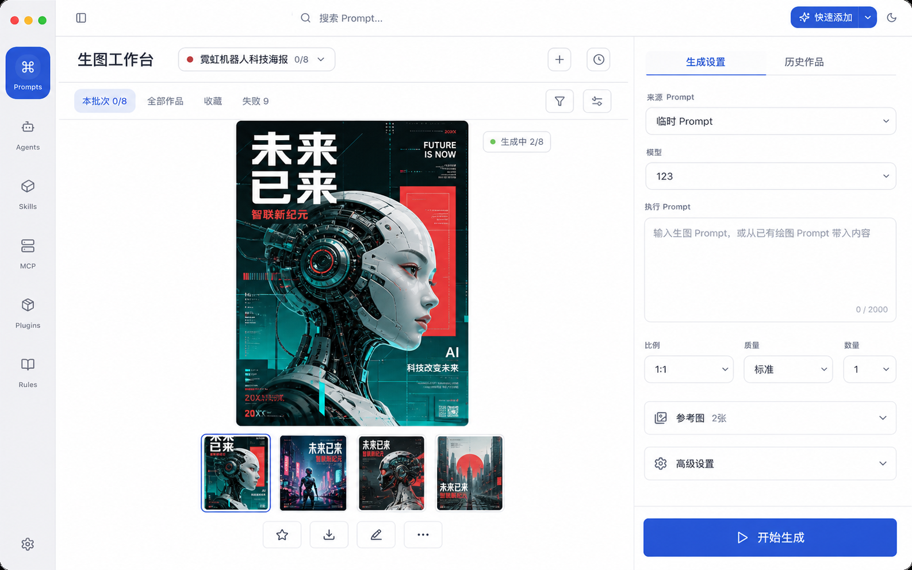

# Desktop Image Generation Workbench Design Draft

## Status

- Phase: implement
- Design maturity: detailed contracts and acceptance matrix complete
- Implementation readiness: Desktop vertical slice, lightweight review and whole-image editing
  implemented; broader stress/sync/release convergence remains open

本文件记录已确认产品边界、选定 UI 方向和实现前技术设计。详细 contract、状态机和
验收矩阵已经通过 Analyze；已实施批次及剩余收敛项以 `tasks.md` 和
`implementation.md` 为准。

## Selected UI Concept

The user replaced the earlier dense result-grid direction and accepted the following
review-first visual direction on 2026-08-03:

The concept is normative for information architecture and interaction hierarchy, not
pixel-perfect production copy. All shipped labels remain subject to the existing i18n
contract and all controls remain subject to provider capability validation.

Detailed plan artifacts:

- [`data-contract.md`](./data-contract.md): filesystem truth, manifest/index schema,
  atomicity, deletion, recovery and IPC.
- [`orchestration.md`](./orchestration.md): ownership, capabilities, scheduling, retry,
  cancellation and restart recovery.
- [`ui-acceptance.md`](./ui-acceptance.md): selected layout, responsive behavior, UI
  states, accessibility and E2E matrix.

## `DES-IGW-001`: First-Class Workbench Surface

生图工作台应复用现有 Desktop app shell，并作为 Prompts 模块内可直接到达的二级
工作区渲染。它可以从 Prompt 详情接收预填草稿，但不能依赖 Prompt 详情组件存活。

- global left rail 继续选中 Prompts，不增加独立“生图”一级入口。
- Prompts 二级导航增加“生图工作台”，与“收藏”“关系图谱”同级，位于文件夹树之前。
- 顶部“全部 / 文本 / 绘图”继续表示 Prompt 类型筛选，不承担工作台导航职责。
- 从 Prompt 详情进入时携带当前 Prompt 和版本快照；直接进入时恢复最近批次或展示
  可执行空态，不隐式创建 Prompt。
- 工作台采用画布优先的左右布局：左侧是占主导宽度的渐进结果墙，右侧是
  固定生成配置面板。批次历史不长期占用右栏；顶部运行状态是按需批次抽屉入口。
  不再使用横跨画布的顶部生成配置。

### Workspace Regions

| Region               | Responsibility                                                               |
| -------------------- | ---------------------------------------------------------------------------- |
| Prompts 二级导航     | 进入工作台并保持用户对 Prompts 所属关系的认知。                              |
| 右侧生成配置         | 选择源 Prompt/版本、模型、比例、质量、数量，检查解析文本与参考图并提交批次。 |
| 结果过滤与密度工具栏 | 在当前批次、全部作品、收藏和失败之间切换，并控制排序、密度和多选。           |
| 渐进结果墙           | 以稳定占位展示完成、生成中和失败输出；批次未结束时允许先筛选与处理成功结果。 |
| 按需批次抽屉         | 从顶部运行状态打开，用于切换批次、新建批次和查看来源快照；默认保持关闭。     |
| 底部上下文操作栏     | 仅在选择输出时出现，集中收藏、设为参考、下载、导出所选和清除选择。           |

### Primary Interaction Flow

1. 用户从 Prompts 二级导航直接进入，或从 image Prompt 详情携带预填草稿进入。
2. 用户确认源 Prompt/版本、变量解析、参考图、模型能力和目标数量；新草稿默认只生成
   1 张，新建批次时数量恢复为 1。
3. 提交后结果墙立即建立稳定占位并渐进填充成功输出；顶部状态可按需打开批次抽屉。
4. 用户不必等待整个批次结束即可收藏、筛选、设为参考或导出已完成输出。
5. 用户选中单图时，右侧切换为 provenance 详情，并可调整后生成或回到所属批次。
6. 离开页面不终止任务；再次进入时恢复批次准确状态、已完成输出和可执行失败动作。

### Required UI States

- 首次进入且无模型配置：展示设置入口，不显示不可执行的生成按钮。
- 无历史但配置可用：展示可直接选择 Prompt 或输入临时 Prompt 的创作空态。
- 运行中：同时显示总进度、单输出占位和已完成结果，不使用阻塞整页 loading。
- 部分失败：成功结果保持可操作，失败数量可筛选，并提供只重试失败项。
- 已取消或中断：保留已成功输出，明确剩余数量和恢复/补齐动作。
- 大批次：结果墙使用虚拟化和缩略图策略，工具栏、队列和选择状态不随内容抖动。

## `DES-IGW-002`: Durable Generation Orchestration Boundary

批次拆分、并发、限流、取消、重试和状态归约必须由独立 orchestration/service
边界持有，不放在 React 组件生命周期中。

编排边界接收一个已经校验的批次快照，按照模型 capability 把用户目标数量拆为供应商
请求，并把每次状态变化持久化后再通知 renderer。已提交但供应商不支持取消的请求
不会伪装成已取消。

## `DES-IGW-003`: Generation Records As A New Data Boundary

候选数据边界包含：

- generation batch/run：用户提交快照、目标数量、模型、状态和计数。
- generation attempt：一次供应商请求、重试序号、状态和安全错误摘要。
- generation output：本地文件、尺寸、状态、收藏、来源和父输出关系。

作品合集不属于当前首版需求；数据模型不得为了未确认的后续功能预先增加空抽象。

文件系统继续遵循现有 `data/` 唯一真相源合同：

- `data/generations/<batch-id>/batch.json` 保存批次、attempt、output 元数据和不可变
  执行快照；写入采用临时文件、flush、原子 rename。
- `data/generations/assets/<batch-id>/<output-id>.<ext>` 保存成功输出原图；旧纵向切片
  曾写入的 `data/assets/images/generated/` 仅作为兼容读取来源。
- `cache/generated-thumbnails/` 只保存可重建缩略图，不进入备份或同步。
- SQLite generation tables 仅作为查询、筛选、排序和状态恢复索引，必须能从上述
  manifest 和资产目录重建；不得成为生成记录唯一真相源。

Prompt 只保留可选关联，不承担批次存储。源 Prompt 删除时，索引中的 live
`sourcePromptId` 置空，manifest 中的标题、版本、解析文本和参数快照保持不变；生成
资产只由显式批次/输出删除流程清理。

## `DES-IGW-004`: Prompt Snapshot And Provenance

批次必须保存执行时的不可变输入快照：

- source Prompt ID 及可获得的版本标识；
- 变量值与变量解析后的最终 Prompt；
- provider/model 的稳定身份；
- 经 capability 校验的参数；
- 参考图稳定引用或内容标识；
- parent output / retry source；
- requested/succeeded/failed/cancelled 计数和时间。

快照不得包含 API key。是否同时保存安全过滤后的 provider raw metadata 在 plan 阶段
决定。

## `DES-IGW-005`: Capability-Normalized Image Requests

复用现有 image-generation route 与 provider adapters，在共享 capability contract
上补足数量上限、参考图、尺寸、质量、seed 和其他参数支持情况。工作台配置由
capability 派生，不能建立一套与 Settings 分叉的 provider 判断。

首版优先保证已有 adapter 的共同能力。供应商独有参数可以渐进开放，但必须保留
“不支持”或“降级”的显式语义。

## `DES-IGW-006`: Local Asset And Export Boundary

图片文件路径继续由 `packages/core/src/runtime-paths.ts` 决定，Desktop main 负责实际
写入、读取、删除和导出。Renderer 只持有安全标识和协议 URL，不接收任意文件系统
写权限。

本地写入顺序固定为：校验输出字节和 MIME -> 写同目录 staging 文件 -> flush 并原子
rename 到 generated asset 路径 -> 原子更新 batch manifest -> 在单个 SQLite 事务中
更新派生索引 -> 通知 renderer。SQLite 更新失败不删除已经进入 manifest 的成功资产，
而是标记索引待重建；manifest 更新失败则删除本次 staging/final 文件或登记恢复候选，
不得把输出计为成功。

首版不做跨批次内容哈希去重，避免共享文件引用计数扩大删除和恢复风险。每个输出拥有
独立文件；manifest 记录 SHA-256、字节数、MIME 和相对路径。缩略图属于 cache，可按
原图重建。

删除单图时先写入 manifest tombstone，再更新索引，最后删除无引用文件；文件删除失败
时保留 tombstone 和可重试清理状态。删除批次复用同一逐输出流程。删除源 Prompt 不
触发生成资产删除。

## `DES-IGW-007`: Progressive And Virtualized Result UI

结果区应按批次渐进接收已持久输出，并复用现有虚拟化、媒体 URL、选择、收藏、批量
操作和详情模式。网格需要稳定占位，避免不同宽高比或 loading 状态改变工具栏和
整体布局尺寸。

单图详情读取 generation output 与 batch snapshot，而不是反查当前 Prompt 内容来
重建历史。

## `DES-IGW-008`: Recovery And Idempotency

应用启动时扫描非终态批次：

- 有可靠 provider job ID 和 polling contract 时，可以恢复查询；
- 无法确认的请求转为 interrupted，不继续显示 running；
- 成功文件和记录保持可用；
- retry 只补足失败或中断目标，并与原批次建立关系；
- 重复回调不能重复增加成功计数或创建重复输出。

## `DES-IGW-009`: Backup, Sync And Web Capability Boundary

generation manifest 与生成原图属于设备本地真相源。首版远端 payload builders 必须
显式排除 `data/generations/` 和旧版 `data/assets/images/generated/`：WebDAV、S3、
self-hosted 和 PromptHub 云端都不得上传批次记录或生成原图。现有同步只收集 Prompt
记录直接引用的媒体，generated 子目录也不得被通用 image listing 意外扫入。

用户执行“添加到 Prompt”时，系统为该 Prompt 创建普通媒体引用；该被 Prompt 引用的
媒体副本或稳定资产随后遵循现有 Prompt 备份/同步合同，但工作台原始输出仍保持本地。
批次导出是用户控制的本地文件复制，不属于云上传。

应用升级、数据目录迁移和同设备恢复不得删除本地 generation 目录。未来会员云空间
属于独立产品合同，必须新增 entitlement、配额预检、用户显式选择、上传状态、远端
删除和恢复规则；首版不预留伪造的已上传状态。

Desktop 能力不能因为 renderer 复用到 Web 而默认宣称 Web 支持本地批量任务。Web
必须通过 capability flags 隐藏或拒绝未实现合同。

## Affected Areas

## `DES-IGW-010`: Progressive-Disclosure Desktop Workbench (revised 2026-09-01)

Batch confirmed with the maintainer; implements `FR-IGW-016`.

### Information architecture

- The default workbench uses one persistent region: the dominant review canvas. Generation settings and bounded history share an on-demand right drawer that is closed while reviewing an existing batch. Starting a draft or choosing the continuation entry opens settings; choosing history opens the history view; successful submission closes the drawer and submission failure leaves it open.
- While the Prompt module is in generation mode, the global module rail remains visible and the Prompts secondary panel is suppressed on entry. The global top-bar sidebar control toggles a transient workbench-only expansion state shared by the separate rail/panel mounts. That state is excluded from persisted UI storage, while the ordinary `isSidebarCollapsed` preference remains untouched and resumes when the user leaves the workbench.
- The header has one stable identity row. New batch, history and a single workbench-actions menu remain available; current/all/favorite/failed filters, sort, density, cancel and retry live in that dismissible menu. A slim live progress bar renders below the identity row while the selected batch is queued or running.
- The generic Prompt search/create top bar is suppressed while the workbench owns the surface, preventing duplicate headers and duplicate New actions. Its transient secondary-sidebar toggle moves into the workbench identity row and keeps the existing non-persistent state contract.
- The settings drawer preserves Source Prompt, model, execution Prompt, required variables, aspect ratio, quality and output count without changing their data or submit contracts. Output count remains a visibly labeled field; the fixed footer contains only the primary generation action. Only optional reference previews live in a collapsed-by-default disclosure with a compact count summary.
- The current-batch view promotes the first successful output into a large `object-contain` review surface and renders all slots in a horizontally scrollable, responsive landscape thumbnail strip. Thumbnail selection only changes the focused output; the large preview opens the existing lightbox. All/favorite/failed filters keep the existing grid/list modes. Unsuccessful slots use compact neutral cards with status text and icons instead of destructive full-card fills.
- A new draft is an explicit transient UI state, not a missing batch ID that falls back to the newest batch. In this state the current-batch filter resolves to an empty result set, while the header history switcher remains available. Selecting history or successfully submitting exits draft mode.
- Completed-image actions no longer reserve a permanent toolbar. One `More` trigger above the primary preview and the preview's context-menu event open the same menu for favorite, download, copy execution Prompt and conditional add-to-Prompt. Workbench-level filters and batch actions remain separate in the header menu.
- Popovers and the drawer close on outside pointer interaction or explicit controls as appropriate, Escape closes menus, and all triggers expose `aria-expanded`/menu or dialog semantics without adding a backdrop that blocks review.

### Lightbox

- Clicking a completed output opens a lightbox (`role="dialog"`): large image, batch/prompt metadata, keyboard left/right navigation within the current gallery ordering, Escape to close, and the same action set as the selection bar (favorite, download, copy execution prompt, add to source Prompt). Tile click semantics become: click opens the lightbox; selection for batch actions uses the hover/selected checkbox affordance.

### Selection and cleanup

- Desktop selection semantics replace the multi-select mode toggle: single click on the checkbox toggles selection, Shift/Ctrl+click on a tile adds to the selection set; the checkbox affordance is visible on hover or when selected, not permanently.
- Required variable inputs and resolved-preview remain visible whenever a source prompt with variables is selected. The reference disclosure contains only optional reference media and is not a generic "Advanced" placeholder.
- Reference selection is explicit draft state owned by `ImageGenerationWorkbench`; selecting a source Prompt does not mutate it. The disclosure exposes a native picker/drop target plus an on-demand Prompt media chooser. Local files are copied through the existing main-process image boundary, selected references are deduplicated by managed file name, and native drag ordering updates the immutable request order. The renderer never persists or sends an external absolute path. The Prompt media chooser scans metadata once per Prompt-list change and mounts thumbnails in pages of 24, avoiding an unbounded image DOM for large libraries.
- Until the shared capability object is implemented, the current Gemini image adapter retains the existing conservative maximum of two references. Other adapters expose a maximum of zero and disable reference input before submission.
- All surfaces follow the existing neutral design tokens; no new dependencies.

## `DES-IGW-011`: Whole-Image Editing And Provider Routing

Batch implements `FR-IGW-017` without adding a second durable workflow or storage root.

- `references.length > 0` is the only edit-mode source of truth. The composer changes the
  primary action and Prompt guidance from generation to editing, while removal of the final
  reference returns to generation mode. No independent mode toggle is persisted.
- A generation reference stores `batchId`, `outputId`, and the managed `fileName`. Renderer
  previews use the existing `local-generation-image` protocol. Execution asks Desktop main
  for the verified bytes; main resolves the manifest output, rejects traversal or identity
  mismatch, enforces the existing 20 MiB image limit, and verifies byte size, MIME and SHA-256
  before returning base64. Retry reuses the same persisted reference identifiers.
- “Continue from this image” adds the focused output as a generation reference, opens the
  settings drawer, and selects the first configured editing-capable model when the current
  model cannot edit. The source batch remains unchanged; no implicit Prompt-media copy occurs.
- Capability remains adapter-owned: compatible Gemini image models accept at most two ordered
  references; GPT Image models accept at most four as a PromptHub product bound; all other
  providers expose zero until an adapter is verified.
- Gemini keeps its current native multimodal request. GPT Image sends a multipart `POST` to
  `/v1/images/edits` with `model`, `prompt`, optional normalized `size`/`quality`, and repeated
  `image[]` parts. Text-only GPT Image requests continue using `/v1/images/generations`.
- The shared AI transport gains a bounded multipart description rather than passing renderer
  `FormData` through IPC. Main validates mutually exclusive JSON/multipart bodies, at most four
  PNG/JPEG/WebP files, base64 shape and 20 MiB per file, builds `FormData`, and leaves the
  `Content-Type` boundary to `fetch`. Browser fallback constructs the equivalent form locally.
- Mask files, canvas painting, partial inpainting, provider-specific composition controls and
  automatic reference selection remain out of scope for this batch.

## `DES-IGW-012`: In-Flow Inspector Layout

Batch implements `FR-IGW-018` and replaces the overlay inspector introduced by the lightweight
review pass.

- The workbench root becomes a vertical shell: one full-width identity header followed by one
  `min-height: 0` horizontal content row. Gallery and inspector are siblings in that row.
- The gallery owns `min-width: 0` and `flex: 1`; the inspector owns a bounded 320–390 px width and
  `flex-shrink: 0`. Opening the inspector therefore reflows and recenters the review stage instead
  of painting above it. Closing it removes the sibling and returns the gallery to full width.
- No supported Desktop width falls back to an overlay. At compact widths the main image continues
  to use `object-contain`, landscape thumbnails stay horizontally scrollable inside the gallery,
  and only the panel's content scrolls vertically.
- The closed Details affordance remains an edge control within the content row. Lightbox remains
  a true overlay because it intentionally owns focus and temporarily replaces review context.
- Inspector data, tabs, width range, submit lifecycle, history bound and progressive-disclosure
  state remain unchanged. This is a layout correction, not a second settings workflow.

## `DES-IGW-013`: Mutually Exclusive Auxiliary Sidebars

Batch implements `FR-IGW-019` with one workbench-local coordination boundary.

- `openInspector(tab)` first collapses `isWorkbenchSidebarExpanded`, then selects the requested
  inspector tab and opens the right panel. New batch, History, Details and Continue all use this
  single entry instead of duplicating partial state transitions.
- The workbench sidebar toggle closes the inspector before expanding the Prompts secondary panel.
  Collapsing the Prompts panel does not reopen the inspector implicitly; the user chooses the next
  auxiliary surface explicitly.
- The 80 px global module rail is outside this mutual-exclusion pair and remains visible.
- The transient workbench sidebar flag remains excluded from persisted UI state. Inspector tab,
  draft and generation state remain owned by the workbench and are not reset by the switch.
- This deterministic rule applies at every supported width, avoiding viewport listeners,
  breakpoint-dependent surprises and simultaneous 288–640 px left plus 320–390 px right panels.

## Affected Areas (original)

- Data model: new filesystem generation manifests plus rebuildable SQLite indexes.
- Shared contracts: batch, output, status, capability and IPC types in
  `packages/shared`.
- Core: reusable orchestration/policy logic where it is not Electron-specific.
- Desktop main: filesystem operations, long-task lifecycle and IPC handlers.
- Preload: minimum typed generation and asset APIs.
- Desktop renderer: navigation, configuration, progress, gallery, detail and
  batch actions.
- Backup/sync: explicit exclusion from every remote payload; preserve local directories
  during upgrade and data-layout migration.
- Web: explicit unsupported/limited capability behavior for the first release.

## Failure And Rollback

| Boundary                        | Required behavior                                                                   |
| ------------------------------- | ----------------------------------------------------------------------------------- |
| Provider request fails          | Mark only affected attempt/output failed; preserve prior successes.                 |
| Rate limit                      | Bounded backoff or actionable retry; no unbounded hot loop.                         |
| Image download fails            | Do not count output as durable success.                                             |
| Disk write fails                | Preserve batch evidence and expose recoverable failure when possible.               |
| DB write fails after file write | Clean staged file or register it for deterministic recovery.                        |
| Delete fails partially          | Restore prior visible state or report incomplete cleanup without losing references. |
| App exits                       | Persist completed work; non-recoverable active work becomes interrupted.            |
| Migration fails                 | Existing Prompt and image behavior remains readable; no destructive fallback.       |

## Verification Plan

- `TEST-IGW-001`: UI behavior test proves a user can enter the workbench directly,
  select an existing Prompt or ad-hoc text, resolve variables and submit valid input.
- `TEST-IGW-002`: orchestration tests prove a 50-output batch is split by provider
  request limit, progress counts remain consistent, and completed results surface
  before the batch ends.
- `TEST-IGW-003`: branch/failure tests cover partial success, rate limiting, bounded
  retry, cancel remaining, uncancellable in-flight work and retry-failed-only.
- `TEST-IGW-004`: real SQLite and filesystem integration tests prove snapshot,
  output, favorite and source relations survive reload without half-written state.
- `TEST-IGW-005`: recovery tests prove app restart preserves successful outputs and
  converts unrecoverable running work to interrupted without duplicate retry outputs.
- `TEST-IGW-006`: security/boundary tests cover malformed counts, oversized batches,
  Unicode filenames, traversal, null bytes, remote URL validation, missing references,
  secret redaction and untrusted error text.
- `TEST-IGW-007`: stress tests cover at least 100 target outputs and a 10,000-item
  metadata library while bounding mounted media and renderer memory growth.
- `TEST-IGW-008`: Desktop UI operation/E2E verifies generation progress, live result
  insertion, filtering, multi-select, favorite, cancellation, retry, detail, export,
  empty/error/interrupted states and narrow/wide layouts.
- `TEST-IGW-009`: migration, local preservation, remote payload exclusion and Web
  capability contract tests prove existing users upgrade safely, WebDAV/S3/self-hosted
  uploads contain no generation records or originals, and unsupported Web surfaces do
  not fabricate success.
- `TEST-IGW-010`: Desktop component and visual regression tests prove rail-only Prompt
  navigation in generation mode, the focused review stage, thumbnail focus switching,
  the default-collapsed settings/history drawer, `More` and right-click image actions,
  bounded history rendering, compact failure states and the accepted wide/compact geometry.
- `TEST-IGW-011`: Desktop component and store regressions prove the global top-bar
  control temporarily expands and collapses the Prompt secondary panel in generation
  mode without mutating or persisting the ordinary sidebar preference.
- `TEST-IGW-012`: Unit, component and contract tests prove edit mode derives from selected
  references; historical outputs are reloaded only after identity, size, MIME and hash
  verification; GPT Image uses bounded multipart `/images/edits`; text-only generation remains
  unchanged; unsupported providers fail before batch creation; and “Continue from this image”
  seeds the focused output and opens an actionable editing draft.
- `TEST-IGW-013`: Desktop component and rendered Electron checks prove the shared header spans
  both regions; gallery and inspector are in-flow siblings; the inspector has no absolute/fixed
  positioning; opening and closing it preserves batch/focus state; and wide plus compact viewports
  have no overlap or page-level horizontal overflow.
- `TEST-IGW-014`: Component and Electron interaction checks prove expanding the Prompts secondary
  panel closes the inspector; opening New/History/Details/Continue collapses the secondary panel;
  the global module rail remains; focus/batch/draft state survives; and compact viewports never
  render both auxiliary panels simultaneously.

## Analyze Result

- Requirement coverage: drafted for all `FR-IGW-*` and `NFR-IGW-*`.
- Existing behavior conflict: none; this adds a new domain around current image Prompt
  generation rather than redefining current Prompt content.
- Navigation decision: confirmed as Prompts secondary navigation, peer to relationship
  graph; no global left-rail item.
- Confirmed product decisions: independent asset lifetime, 100-output batch maximum,
  one model per batch and duplicate-to-switch behavior.
- Resolved sync conflict: the user explicitly confirmed a first-release local-only
  exception for generation records and originals. Future opt-in member cloud storage is
  a separate change.
- Detailed contract coverage: data, orchestration and UI acceptance artifacts complete.
- Active change conflict check: `app-shell-left-rail` is unaffected because no global
  item is added; `web-sync-contract-completion` continues to transport its existing
  supported domains and must not begin collecting the explicitly local generation
  directories.
- Analyze gate: **passed** for documentation and implementation planning. Production
  implementation remains separately gated by test-first tasks.

## Traceability

| Requirement                              | Design                                      | Verification                                   | Task                                  |
| ---------------------------------------- | ------------------------------------------- | ---------------------------------------------- | ------------------------------------- |
| `FR-IGW-001`, `FR-IGW-002`               | `DES-IGW-001`, `DES-IGW-004`                | `TEST-IGW-001`, `TEST-IGW-008`                 | `T-IGW-002`, `T-IGW-006`              |
| `FR-IGW-003`, `FR-IGW-004`               | `DES-IGW-002`, `DES-IGW-005`                | `TEST-IGW-002`, `TEST-IGW-003`, `TEST-IGW-006` | `T-IGW-003`, `T-IGW-005`              |
| `FR-IGW-005`, `FR-IGW-010`, `FR-IGW-011` | `DES-IGW-003`, `DES-IGW-004`, `DES-IGW-006` | `TEST-IGW-004`, `TEST-IGW-006`, `TEST-IGW-008` | `T-IGW-004`, `T-IGW-006`              |
| `FR-IGW-006`, `FR-IGW-007`, `FR-IGW-008` | `DES-IGW-002`, `DES-IGW-007`, `DES-IGW-008` | `TEST-IGW-002`, `TEST-IGW-003`, `TEST-IGW-005` | `T-IGW-003`, `T-IGW-005`, `T-IGW-006` |
| `FR-IGW-009`, `FR-IGW-012`               | `DES-IGW-006`, `DES-IGW-007`                | `TEST-IGW-004`, `TEST-IGW-007`, `TEST-IGW-008` | `T-IGW-004`, `T-IGW-006`              |
| `FR-IGW-013`, `FR-IGW-014`               | `DES-IGW-003`, `DES-IGW-006`, `DES-IGW-008` | `TEST-IGW-004`, `TEST-IGW-005`, `TEST-IGW-009` | `T-IGW-004`, `T-IGW-005`              |
| `FR-IGW-015`                             | `DES-IGW-006`, `DES-IGW-009`                | `TEST-IGW-006`, `TEST-IGW-009`                 | `T-IGW-004`, `T-IGW-007`              |
| `FR-IGW-016`                             | `DES-IGW-010`                               | `TEST-IGW-008`, `TEST-IGW-010`, `TEST-IGW-011` | `T-IGW-016`..`T-IGW-024`              |
| `FR-IGW-017`                             | `DES-IGW-005`, `DES-IGW-011`                | `TEST-IGW-006`, `TEST-IGW-012`                 | `T-IGW-026`                           |
| `FR-IGW-018`                             | `DES-IGW-010`, `DES-IGW-012`                | `TEST-IGW-010`, `TEST-IGW-013`                 | `T-IGW-027`                           |
| `FR-IGW-019`                             | `DES-IGW-012`, `DES-IGW-013`                | `TEST-IGW-011`, `TEST-IGW-014`                 | `T-IGW-028`                           |
| `NFR-IGW-001`..`NFR-IGW-008`             | `DES-IGW-002`..`DES-IGW-009`                | `TEST-IGW-003`..`TEST-IGW-009`                 | `T-IGW-004`..`T-IGW-008`              |
| `NFR-IGW-SYNC-001`                       | `DES-IGW-009`                               | `TEST-IGW-009`                                 | `T-IGW-007`, `T-IGW-012`              |
